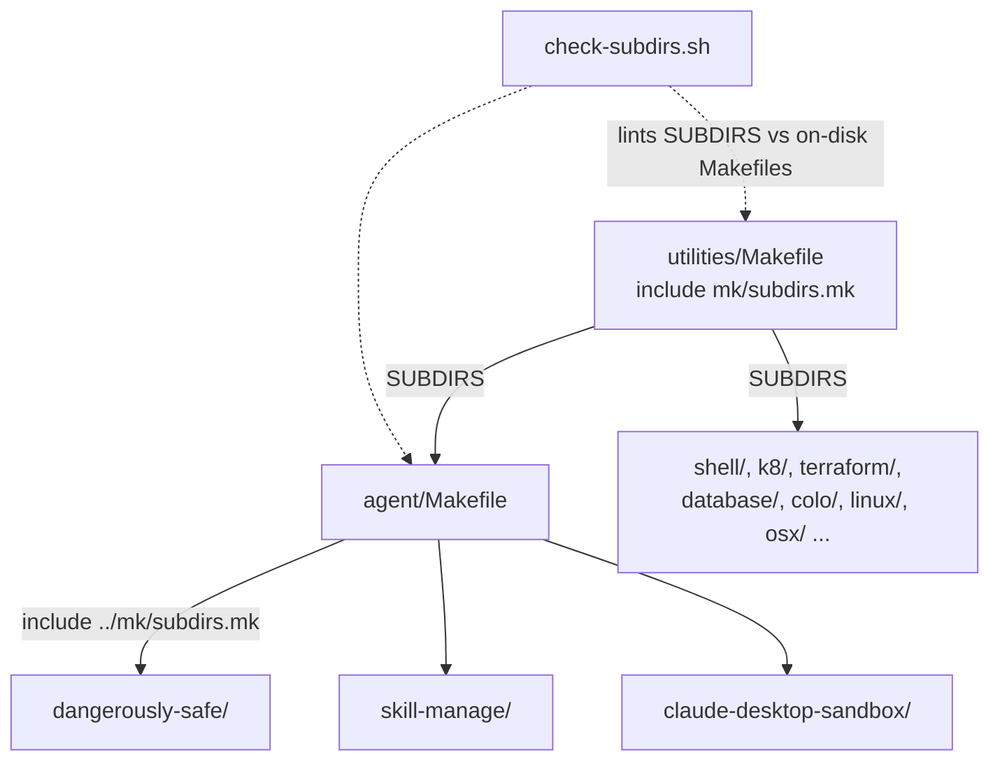

# Project Architecture

## Overview

`utilities/mk` is a small, dependency-free Make include package that powers the
recursive Makefile tree under `utilities/` in the Noizu Infra monorepo. It has
no runtime of its own: it is pure build-orchestration glue consumed at
`make`-parse time by parent Makefiles (`include ../mk/subdirs.mk`), plus a
standalone shell checker that keeps the declared tree honest.

The design goal is capability-aware fan-out: a parent Makefile declares
`SUBDIRS`, and standard targets (`build`, `compile`, `test`, `install`,
`clean`) recurse only into children that actually declare the target — so
heterogeneous subprojects (shell scripts, Rust crates, scaffolds) can coexist
in one tree without every child stubbing out every target.

## Core Components

| Component | Purpose |
|-----------|---------|
| `subdirs.mk` | Include fragment: fans `SUBDIR_TARGETS` out to `SUBDIRS` children, with per-child target probing and `build`→`compile` fallback |
| `check-subdirs.sh` | Standalone bash linter: validates `SUBDIRS` declarations against Makefiles actually on disk; non-zero exit for CI/pre-commit gating |
| `docs/` | This documentation (PROJ-LAYOUT, PROJ-ARCH, summaries) |

## Dispatch Flow

For each requested target, `subdirs.mk` probes the child via `make -C <dir> -pn`
and parses the child's `.PHONY` line to confirm the target exists; missing
targets are skipped with a labeled notice rather than failing the run. A
`build` request falls back to `compile` when only the latter is declared. Each
subdir name is also a phony target, so `make agent` runs `make -C agent`
directly.

## Consistency Checking

`check-subdirs.sh [root]` (defaults to cwd; the `mk/` directory itself is
pruned) walks every `Makefile` in the tree and reports three inconsistency
classes: `[MISSING-FROM-PARENT]` (child Makefile not listed in parent
`SUBDIRS`), `[MISSING-SUBDIRS]` (parent with Makefile-bearing children but no
`SUBDIRS` declaration), and `[MISSING-CHILD]` (`SUBDIRS` entry with no
Makefile). It exits non-zero on any finding, making it a drop-in CI or
pre-commit gate.

## Ecosystem Fit

- **`make install-utilities`** at the monorepo root drives
  `utilities/Makefile`, which includes `mk/subdirs.mk` for
  `build`/`compile`/`test`/`clean` fan-out; `install` is handled by a custom
  `_utilities_install` loop there (skipping `osx` on non-Mac hosts) that
  installs tools into `~/.local/bin`.
- Grouping Makefiles (`agent/`, `shell/`, `k8/`, `terraform/`, `database/`,
  `colo/`, `linux/`, `osx/`) each `include ../mk/subdirs.mk`, giving the whole
  utilities tree one consistent recursion idiom.
- `mk` is orthogonal to the runtime conventions of the utilities it builds: it
  has no dependency on `share/k8-lib`, `.infra-config.yaml`, or direnv — those
  concern the installed tools' behavior, not their build dispatch.

## Key Decisions

- **Probe `.PHONY` via `make -pn` instead of blind recursion**: children never
  need placeholder targets; absent targets are skipped, not errors.
- **`build` → `compile` fallback**: lets script-only children declare just
  `compile` while compiled children (e.g. Rust) use `build`, and a top-level
  `make build` still reaches both.
- **Checker as a separate script, not a Make target**: keeps `subdirs.mk`
  minimal and lets the lint run against any tree root independently of Make.
- **Self-exclusion**: `check-subdirs.sh` prunes `mk/` so the package can live
  inside the tree it validates.
