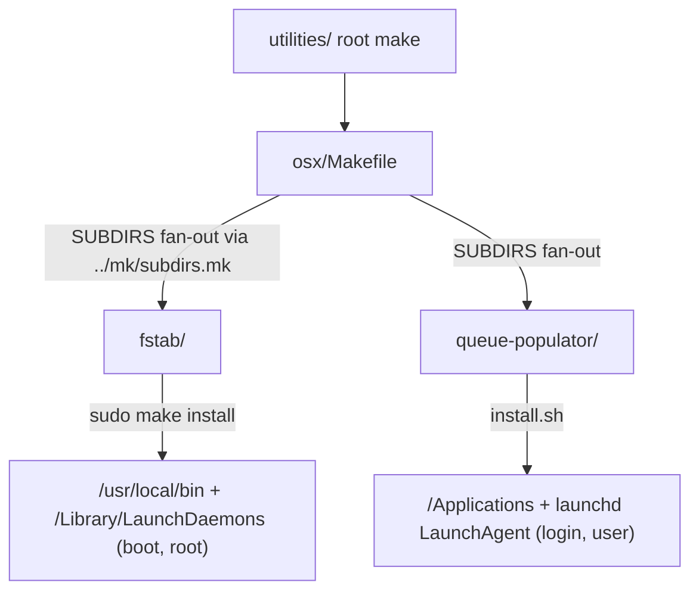

# Project Architecture — utilities/osx

## Overview

`utilities/osx` is a **grouping directory**, not an application: it collects standalone
macOS-host utilities that live in the Noizu monorepo but run on a Mac workstation rather
than the k8s platform. Its only first-class artifact is a thin fan-out `Makefile`; all real
architecture lives in the children, each of which maintains its own docs (linked below).

The two current children are architecturally unrelated to each other — one is a boot-time
mount daemon, the other a Swift menu bar app — and share only the convention of being
self-installing macOS tools grouped under this directory.

## System Diagram

## Core Components

| Component | Purpose | Architecture docs |
|-----------|---------|-------------------|
| `Makefile` | Declares `SUBDIRS := fstab queue-populator` and includes shared `utilities/mk/subdirs.mk`, which forwards `build/compile/test/install/clean` to each child, probing `.PHONY` targets so children without a given target are skipped cleanly | (5 lines; this doc) |
| `fstab/` | LaunchDaemon giving macOS Linux-style `/etc/fstab` behavior for APFS/NTFS volumes (NTFS rw via ntfs-3g + FUSE-T); runs once at boot as root | [Arch summary](../fstab/docs/PROJ-ARCH.summary.md) |
| `queue-populator/` | Swift 6 / AppKit menu bar app: wake-phrase voice memos → Apple Speech transcription → LLM classification → JSONL queue; also installs 4 BlackHole-derived virtual microphones | [Arch summary](../queue-populator/docs/PROJ-ARCH.summary.md) |

## Fan-out Build Mechanism

The shared `../mk/subdirs.mk` include drives all grouped utility directories. For each
standard target it inspects the child Makefile's `.PHONY` declarations (`make -pn`) before
recursing: missing targets are reported as skipped rather than failing, and `build` falls
back to `compile` when only the latter exists. Child Makefiles additionally no-op on
non-Darwin hosts, so repo-wide `make` runs stay safe on Linux.

## Ecosystem Fit

Unlike sibling `utilities/*` shell tools, these children do **not** use `share/k8-lib`, are
**not** installed to `~/.local/bin` via `make install-utilities`, and have no
`.infra-config.yaml` build/deploy metadata. Each installs onto the macOS host through its
own mechanism: `fstab` via a sudo Makefile (`/usr/local/bin`, `/Library/LaunchDaemons`),
`queue-populator` via `install.sh` (`/Applications` + a launchd LaunchAgent). A separate
PipeWire-based Linux port of queue-populator exists elsewhere in the repo.

## Key Decisions

- **Grouping dir, not a project** — children are self-contained with their own docs,
  install flows, and lifecycles; this level only aggregates make targets.
- **Shared `subdirs.mk` fan-out** — one reusable include gives every grouping directory
  consistent target forwarding with graceful skipping, instead of bespoke recursion.
- **Host-tool exemption from repo conventions** — macOS workstation tools deliberately
  bypass k8-lib / `.infra-config.yaml`, which target the k8s deploy pipeline.
- **Privilege split** — fstab needs root at boot (LaunchDaemon); queue-populator runs as
  the login user (LaunchAgent). Rationale detailed in each child's arch docs.
