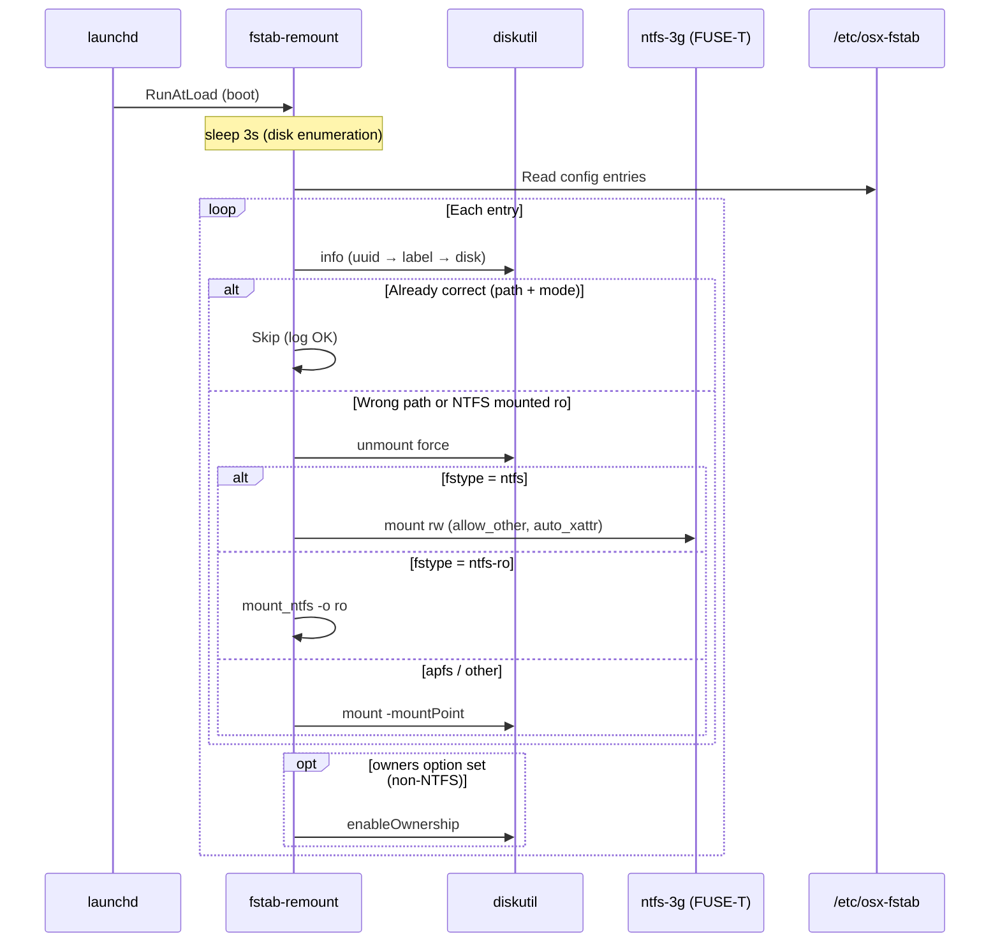
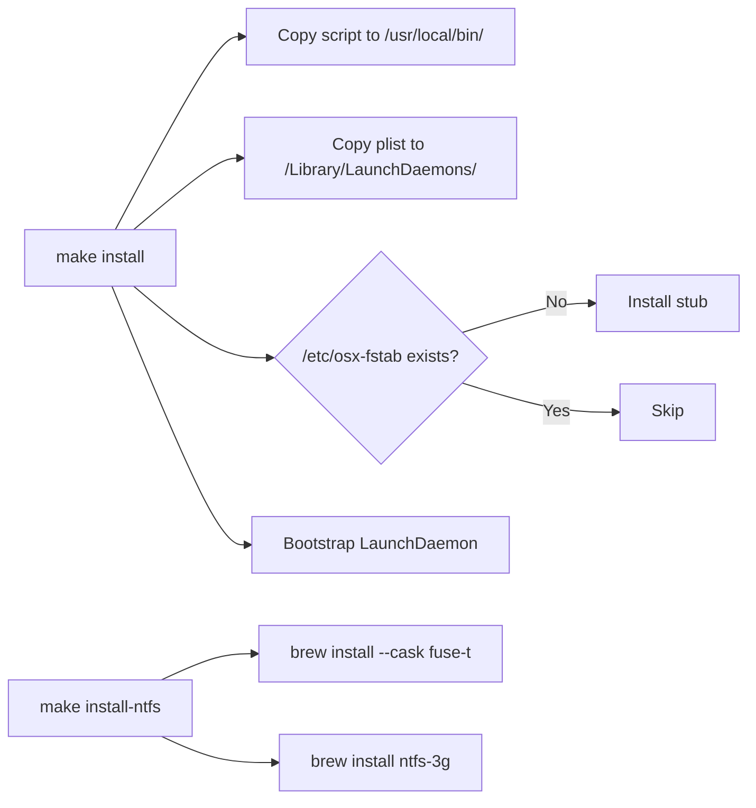

# fstab-mounter — Architecture

## Overview

A macOS LaunchDaemon that provides Linux-style `/etc/fstab` behavior for APFS and NTFS volumes. It reads a config file (`/etc/osx-fstab`) at boot and ensures each declared volume is mounted at its specified path — relocating volumes already mounted elsewhere, remounting NTFS volumes read-write via ntfs-3g/FUSE-T when requested, and enabling ownership where declared.

macOS does not natively support persistent custom mount points for APFS volumes across reboots, and its native NTFS support is read-only. This utility fills both gaps with a single-shot boot-time script driven by a declarative config file.

## Place in the Noizu Utilities Ecosystem

This is a **standalone macOS-host utility**, unlike the Linux/k8s DevOps tools in `utilities/`: it does **not** use `share/k8-lib`, is **not** installed by `make install-utilities`, and has no `.infra-config.yaml` integration. It ships its own `Makefile` that installs to `/usr/local/bin` and `/Library/LaunchDaemons` via sudo on the target Mac. It lives in the monorepo purely for versioning alongside the rest of the infra tooling.

## System Diagram



## Components

| Component | File | Purpose |
|-----------|------|---------|
| Mount script | `fstab-remount` | Bash script — parses config, resolves volumes, mounts by fstype |
| LaunchDaemon plist | `com.keithbrings.fstab-remount.plist` | Runs script once at boot as root, logs to `/var/log/fstab-remount.log` |
| Config stub | `osx-fstab.stub` | Template installed to `/etc/osx-fstab` on first `make install` |
| Installer | `Makefile` | `install` / `uninstall` / `status` / `logs` / `install-ntfs` / `check-ntfs` |
| NTFS one-off helper | `mount-ntfs-rw.sh` | Legacy root script: rw-mounts one hardcoded NTFS volume via native `/etc/fstab` (experimental Apple NTFS write) — superseded by `ntfs` fstype support in the main script |

## Config Format (`/etc/osx-fstab`)

```
uuid=<UUID>  label=<Label>  disk=<device>  <mountpoint>  <fstype>  <options>  0  0
```

- **Identifiers**: `uuid`, `label`, `disk` — tried in that order; use `-` for unavailable
- **Fstypes**: `apfs` (diskutil), `ntfs` (rw via ntfs-3g + FUSE-T), `ntfs-ro` (native `mount_ntfs`, no deps)
- **Options**: `rw`, `auto`, `noauto` (skip), `owners` (enable ownership); `uid=`/`gid=`/`umask=` pass through to ntfs-3g
- **Parsing**: tagged fields extracted first; fstype/options/dump/fsck parsed from the right, so mountpoints and labels may contain spaces (`\040` octal escapes also decoded)
- **Comments**: lines starting with `#` are ignored
- **Env overrides**: `OSX_FSTAB` (config path), `NTFS_3G_BIN` (ntfs-3g binary)

## Volume Resolution Strategy

The script resolves each config entry using a **fallback chain**: UUID → label → disk identifier. The first identifier that `diskutil info` recognizes is used for status checks and unmounting; the mount step retries the full chain per fstype. This handles UUID changes after volume re-creation, label-based matching, and direct device paths as a last resort.

FUSE-T mounts are invisible to `diskutil`, so the script cross-checks `mount(8)` output to detect NTFS volumes already correctly mounted (and to catch volumes stuck read-only that need a rw remount). After an `ntfs` rw mount it re-verifies against the mount table, since ntfs-3g can report success without a live mount.

## Installation Flow



`make install` degrades gracefully: if non-interactive sudo is unavailable it prints the manual command instead of failing (safe under automation).

## Key Design Decisions

| Decision | Rationale |
|----------|-----------|
| LaunchDaemon, not LaunchAgent | Must run as root before user login to mount system-level paths |
| 3-second boot delay | External disks need time to enumerate after boot |
| Force unmount on relocation | Deterministic mount points even if macOS auto-mounted elsewhere |
| Zero deps for APFS path | Only `diskutil`, `bash`, `mkdir` — ships with macOS |
| FUSE-T (not macFUSE) for NTFS rw | Kext-less; no kernel extension approval required |
| `ntfs-ro` fstype offered | Native read-only path when write access isn't needed and Homebrew deps are unwanted |
| Right-anchored field parsing | Lets mountpoints/labels contain spaces without quoting rules |

## Logging

All output goes to `/var/log/fstab-remount.log` (configured in the plist). Log prefixes:

| Prefix | Meaning |
|--------|---------|
| `OK` | Volume already correct, or newly mounted |
| `MOVE` | Volume relocated from wrong mount point |
| `MOUNT` | Volume mounted from unmounted state |
| `REMOUNT` | NTFS volume was read-only; remounting rw |
| `VERIFY` | Post-mount NTFS rw confirmation |
| `NTFS` | ntfs-3g error detail |
| `FAIL` | Mount/unmount failed or verification failed |
| `OWN` | Ownership enabled on volume |
| `WARN` | Ownership enable failed |
