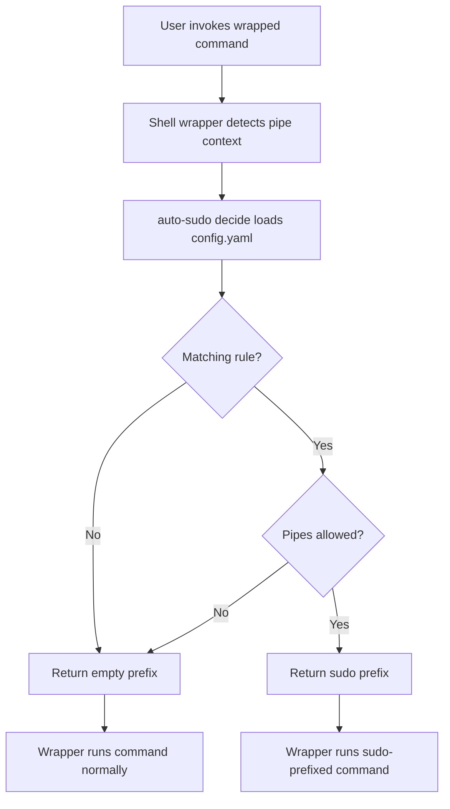

# Architecture - auto-sudo

## Overview

auto-sudo is a Rust CLI that generates shell wrappers and decides whether a
command should be prefixed with `sudo` based on YAML rules. The wrapper calls
`auto-sudo decide`, receives a prefix, then invokes the real command.

## Design

## Components

| Component | Purpose |
|-----------|---------|
| `rust/src/main.rs` | CLI entrypoint and subcommands |
| `rust/src/config.rs` | YAML config model and default path resolution |
| `rust/src/decision.rs` | Rule matching, argument extraction, permission checks |
| `rust/src/shell.rs` | Bash/zsh wrapper generation |
| `rust/src/sudoers.rs` | sudoers snippet generation, toggling, refresh, validation |
| `auto-sudo.zsh` | Small loader that evals generated zsh wrappers |
| `config.example.yaml` | Default example preserving legacy behavior |

## Key Design Decisions

- **CLI decides, shell executes**: `auto-sudo decide` only prints a prefix. It never executes the target command.
- **Config-driven behavior**: Commands, file arguments, flags, pipe policy, and sudo target users are YAML data.
- **Fail closed on config errors**: Wrapper generation and decision calls return non-zero if config cannot be parsed.
- **Pipes denied by default**: `allow_pipes` must be enabled globally or per command to auto-sudo in pipelines.
- **sudoers writes are explicit**: Snippets print by default; writes require an explicit `sudoers write` or `refresh`.

## Extensibility

Add commands and rules to `~/.config/auto-sudo/config.yaml`. Supported file
argument selectors include positional indexes, `position: any`, `--flag=value`,
and `--flag value`. File checks can match permission state, ownership, group
membership, exact/wildcard paths, prefixes, and suffixes.
