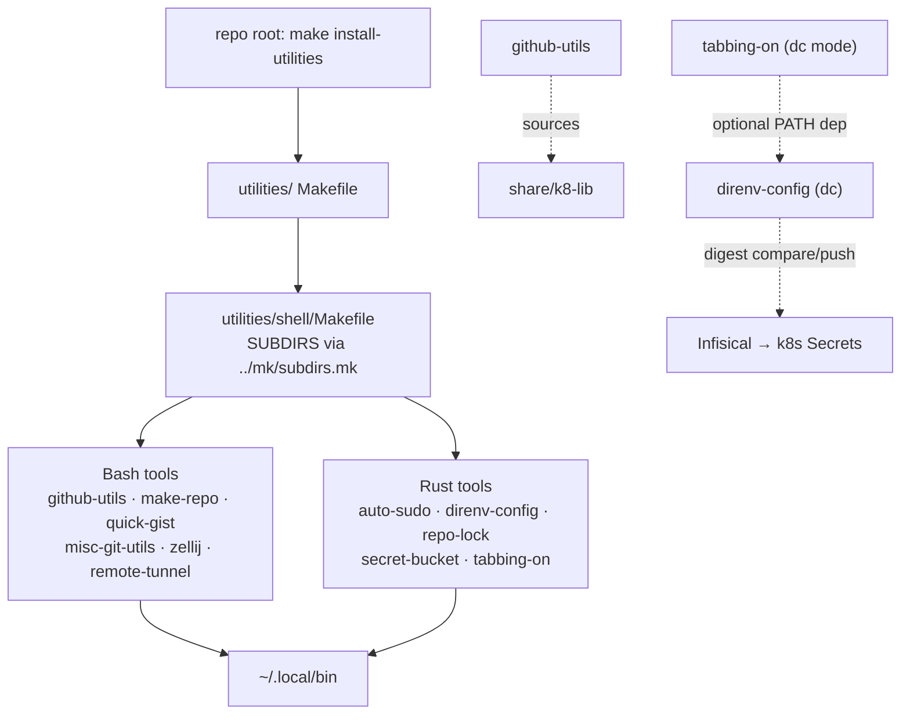

# Project Architecture — utilities/shell

## Overview

`utilities/shell/` is a **grouping directory**, not an application: a curated
toolbelt of eleven self-contained shell/terminal utilities for the Noizu Infra
monorepo. Each child owns its full lifecycle (source, Makefile, docs, tests);
this directory contributes only the aggregation layer — a thin `Makefile`
listing children in `SUBDIRS` and delegating `build/compile/test/install/clean`
to them via the shared `../mk/subdirs.mk`, plus a `source_up`-only `.envrc`
that inherits the parent `utilities/` direnv environment.

Architecturally the group is a **fan-out with no shared runtime**: children
never call each other's internals (the one soft coupling is tabbing-on's
optional dc mode depending on the sibling `direnv-config` tool being on PATH),
and language choice is per-tool — Bash for thin wrappers over `gh`/`git`/
`zellij`, Rust where value-safety, Unicode, or TUI concerns demand it. Child
internals are documented in each child's own `docs/`; this document only maps
the group. See [PROJ-LAYOUT.md](PROJ-LAYOUT.md) for the directory tree.

## Components

| Utility | Language | Role | Arch summary |
|---------|----------|------|--------------|
| auto-sudo | Rust + zsh | Rule-based automatic sudo elevation with managed sudoers entries | [→](../auto-sudo/docs/PROJ-ARCH.summary.md) |
| direnv-config | Rust + 5 SDKs | `dc` — layered YAML config/secret store over `.envrc*`; feeds the Infisical → k8s Secret flow | [→](../direnv-config/docs/PROJ-ARCH.summary.md) |
| github-utils | Bash | `submodule-commit`: fzf-driven deepest-first bulk submodule commit/push (uses k8-lib) | [→](../github-utils/docs/PROJ-ARCH.summary.md) |
| make-repo | Bash | `make-repo`/`fork-repo`: gh-wrapped repo create/edit/fork with env-tiered defaults | [→](../make-repo/docs/PROJ-ARCH.summary.md) |
| misc-git-utils | Bash + Rust | git shortcuts (`gcap`, `gp`, `submodule-*`) + `doc-pointers` durable cross-doc links | [→](../misc-git-utils/docs/PROJ-ARCH.summary.md) |
| quick-gist | Bash | Single-file `gh gist` wrapper with fzf file selection | [→](../quick-gist/docs/PROJ-ARCH.summary.md) |
| remote-tunnel | Bash | autossh reverse SSH + flag-gated ngrok TCP tunnels for NAT'd hosts | [→](../remote-tunnel/docs/PROJ-ARCH.summary.md) |
| repo-lock | Rust | Advisory session file locks + git commit mutex for concurrent agent sessions | [→](../repo-lock/docs/PROJ-ARCH.summary.md) |
| secret-bucket | Rust | Agent-safe, value-free secret list/diff/copy across `.envrc*` stores | [→](../secret-bucket/docs/PROJ-ARCH.summary.md) |
| tabbing-on | Rust + POSIX sh | Terminal tab title/status/theme/todo/recording manager (dual impl + Ink prototype) | [→](../tabbing-on/docs/PROJ-ARCH.summary.md) |
| zellij | Bash + KDL | `zj-*` launchers generating runtime KDL layouts for agent dev workspaces | [→](../zellij/docs/PROJ-ARCH.summary.md) |

## Group Structure

## Build & Install Aggregation

The group `Makefile` sets `SUBDIRS` (all eleven children) and includes
`../mk/subdirs.mk`, which iterates children, introspects each child Makefile
for a matching `.PHONY` target, and skips gracefully when absent (mapping
`build` → `compile` as a fallback). This lets heterogeneous children — cargo
builds, copy-only bash installs, no-op tests — share one uniform interface, so
repo-root `make install-utilities` recurses cleanly through the whole group.
Children conventionally install binaries/scripts to `~/.local/bin`
(remote-tunnel is the outlier, defaulting to `~/bin` via its own `PREFIX`).

## Ecosystem Fit

- **Install convention**: everything targets the user PATH (`~/.local/bin`),
  wired through the repo-root `make install-utilities` chain.
- **k8-lib**: only `github-utils` sources `share/k8-lib`; the other ten are
  deliberately standalone with no shared shell library.
- **`.infra-config.yaml`**: no child reads it — these are developer-machine
  tools, decoupled from the build/deploy metadata layer. `direnv-config` is
  adjacent: `.envrc.k8.dc` stores the scalar config that `.infra-config.yaml`
  tooling consumes, and `dc infisical` bridges into the secrets pipeline.
- **Agent-fleet support**: several tools exist specifically for multi-agent
  workflows on this repo — `repo-lock` (session locks/commit mutex),
  `secret-bucket` (value-free secret ops for agent transcripts), `zellij`
  (agent workspace launchers), `tabbing-on` (per-tab session status).

## Key Decisions

- **Grouping over framework**: no shared runtime library or config schema is
  imposed; each utility stays independently installable and portable, at the
  cost of some per-tool convention drift.
- **Uniform Make interface, introspected**: `subdirs.mk` probes for targets
  instead of requiring every child to stub all five, keeping child Makefiles
  minimal.
- **Language by concern**: Bash where the tool is a thin orchestration wrapper;
  Rust where correctness matters (secret handling, locking, Unicode tokens,
  TUIs).
- **Secrets never printed**: the secret-adjacent tools (`direnv-config`,
  `secret-bucket`) share a value-free/redacted-output contract so agents can
  operate on secret stores without leaking values into transcripts.
