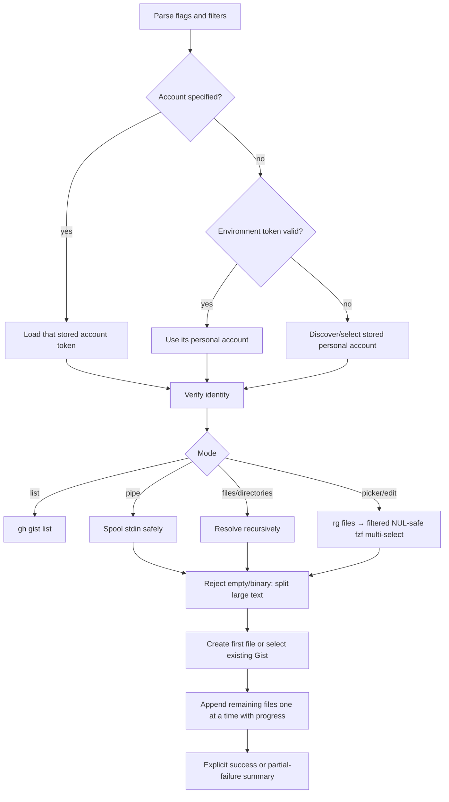

# Project Architecture

## Overview

`quick-gist` is a self-contained bash CLI that wraps GitHub CLI (`gh gist`) with explicit account ownership, reliable result reporting, filtered interactive file selection via `fzf`, and incremental large-file-safe uploads. It follows a dispatch-style architecture: parse flags, resolve a personal account, collect/preflight files, then dispatch to list, create, or append behavior.

It lives in the Noizu Infra monorepo under `utilities/shell/` alongside the other terminal DevOps tools, but is deliberately self-contained: unlike most siblings it does **not** source the shared `share/k8-lib/` shell library and has no `.infra-config.yaml` build/deploy metadata — there is nothing to build or deploy. See [Ecosystem Fit](#ecosystem-fit).

## Dependencies

| Dependency | Required | Purpose |
|------------|----------|---------|
| `gh` (GitHub CLI) | Yes | All gist CRUD operations — authenticated via `gh auth` |
| `fzf` | No | Interactive file picker (required only for interactive/edit modes) |
| `rg` | No | Fast, gitignore-aware recursive candidate discovery (falls back to `find`) |
| `pbcopy`, `wl-copy`, or `xclip` | No | Best-effort cross-platform clipboard copy |
| `split` | For large files | Splits text files above the configured upload threshold |

## Execution Flow

## Modes

| Mode | Trigger | Behavior |
|------|---------|----------|
| **List** | `-l` | Prints 20 most recent gists |
| **Edit** | `-e <id>` | Filtered fzf multi-picker → incrementally adds selected files |
| **Append** | `-a <id>` | Recursively resolves inputs → incrementally adds files |
| **Pipe** | `-p` | Safely spools stdin, preserving large content and configurable name |
| **Create** | default | Explicit files, recursive directories, or filtered fzf selection |

## Ownership Model

GitHub Gists are associated with the personal account that creates them; they cannot be owned by organizations. `--account`/`--owner` selects a stored `gh auth` personal account by exporting its token only inside the `quick-gist` process, so the globally active `gh` account is not changed. A valid caller-supplied token takes precedence; a stale token falls back to stored-account discovery.

## Upload Model

Inputs are required to be non-empty text files because the Gist API represents file bodies as text. Gist filenames are flat, so duplicate basenames are rejected before mutation. Files larger than `QUICK_GIST_CHUNK_SIZE` (8 MiB by default) are split into numbered parts unless `--no-chunk` is selected.

Creation sends the first prepared file through `gh gist create`, then adds each remaining file through an individual `gh gist edit --add` call. This avoids one large aggregate request, provides per-file progress, and allows a failure message to identify the precise point of failure. If an append fails after creation, the script reports the surviving partial Gist URL and exits nonzero.

## Visibility Model

Gists default to **secret**. Precedence (highest wins):

1. `--public` / `--secret` / `-s` flags
2. `QUICK_GIST_VISIBILITY` environment variable
3. Hardcoded default: `secret`

## Ecosystem Fit

Part of the Noizu `utilities/` family installed to `~/.local/bin` (repo-root `make install-utilities` covers the utilities tree; this package also ships its own `Makefile` whose `install` target copies the script to `~/.local/bin`, skipping when source and destination resolve to the same file). `compile`/`test` targets are no-ops kept for uniform Make interfaces across utilities. No k8s, Infisical, or `.infra-config.yaml` coupling — the only external state it touches is the user's `gh` auth.

## Design Decisions

- **Single file, no install deps** — portable; copy to `$PATH` and go
- **`gh` as the only hard dependency** — avoids reimplementing GitHub auth or API calls
- **fzf optional** — graceful degradation to positional-arg mode when fzf is absent
- **Secret by default** — safe default; public requires explicit opt-in
- **Best-effort clipboard** — supports macOS (`pbcopy`), Wayland (`wl-copy`), and X11 (`xclip`); the printed URL is always authoritative
- **Failure is never success-colored** — every mutating `gh` call is checked explicitly despite Bash's error-mode edge cases
