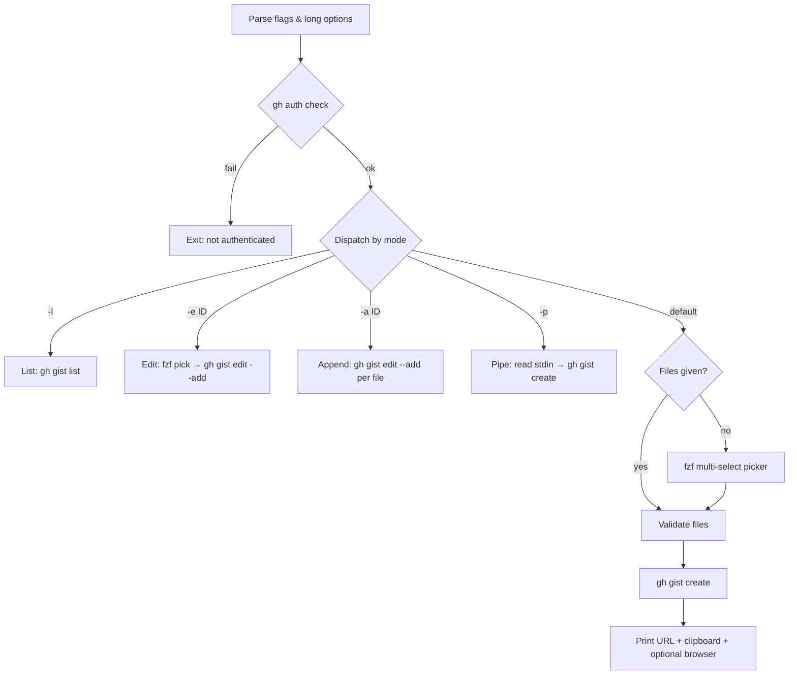

# Project Architecture

## Overview

`quick-gist` is a single-file bash CLI that wraps GitHub CLI (`gh gist`) with ergonomic defaults and interactive file selection via `fzf`. It follows a dispatch-style architecture: parse flags, then branch into one of five mutually exclusive modes.

It lives in the Noizu Infra monorepo under `utilities/shell/` alongside the other terminal DevOps tools, but is deliberately self-contained: unlike most siblings it does **not** source the shared `share/k8-lib/` shell library and has no `.infra-config.yaml` build/deploy metadata — there is nothing to build or deploy. See [Ecosystem Fit](#ecosystem-fit).

## Dependencies

| Dependency | Required | Purpose |
|------------|----------|---------|
| `gh` (GitHub CLI) | Yes | All gist CRUD operations — authenticated via `gh auth` |
| `fzf` | No | Interactive file picker (required only for interactive/edit modes) |
| `pbcopy` | No | macOS clipboard — copies gist URL after creation |

## Execution Flow

## Modes

| Mode | Trigger | Behavior |
|------|---------|----------|
| **List** | `-l` | Prints 20 most recent gists |
| **Edit** | `-e <id>` | fzf picker → adds selected files to existing gist |
| **Append** | `-a <id>` | Adds positional-arg files to existing gist |
| **Pipe** | `-p` | Reads stdin, creates gist with configurable filename (`-n`) |
| **Create** | default | Files from args or fzf → validates → creates gist |

## Visibility Model

Gists default to **secret**. Precedence (highest wins):

1. `--public` / `--secret` / `-s` flags
2. `QUICK_GIST_VISIBILITY` environment variable
3. Hardcoded default: `secret`

## Ecosystem Fit

Part of the Noizu `utilities/` family installed to `~/.local/bin` (repo-root `make install-utilities` covers the utilities tree; this package also ships its own `Makefile` whose `install` target copies the script to `~/.local/bin`, skipping when source and destination resolve to the same file). `compile`/`test` targets are no-ops kept for uniform Make interfaces across utilities. No k8s, Infisical, or `.infra-config.yaml` coupling — the only external state it touches is the user's `gh` auth.

## Design Decisions

- **Single file, no install deps** — portable; copy to `$PATH` and go
- **`gh` as the only hard dependency** — avoids reimplementing GitHub auth or API calls
- **fzf optional** — graceful degradation to positional-arg mode when fzf is absent
- **Secret by default** — safe default; public requires explicit opt-in
- **Best-effort clipboard** — `pbcopy` is macOS-only; on Linux the copy silently no-ops (`2>/dev/null`) and only the printed URL is available
