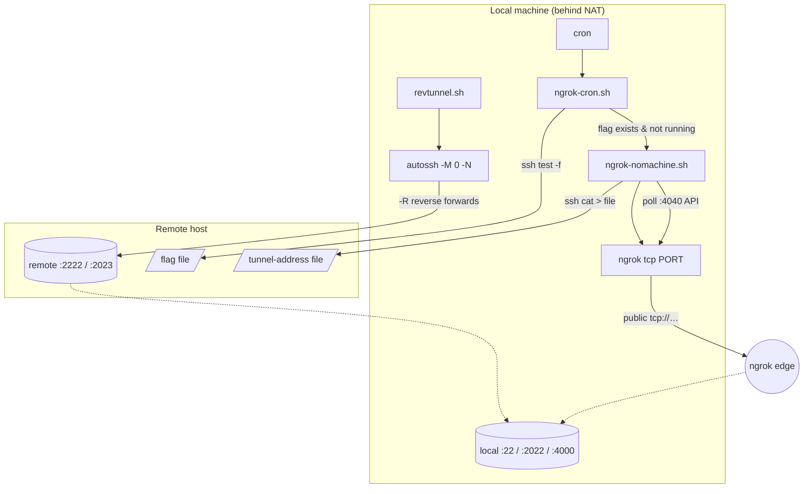

# Project Architecture

## Overview

`remote-tunnel` is a small, self-contained terminal utility package that keeps a
NAT'd / firewalled local machine reachable from remote hosts. It provides two
independent exposure strategies:

1. **Reverse SSH tunneling** (`revtunnel.sh`) — a persistent, self-healing
   reverse tunnel via `autossh`, publishing local ports (SSH, Eternal Terminal)
   on a remote host the operator already controls.
2. **ngrok TCP tunneling** (`ngrok-nomachine.sh` + `ngrok-cron.sh`) — an
   on-demand public TCP endpoint (originally for NoMachine on port 4000) whose
   ephemeral public address is pushed to a file on a remote host so other
   parties can discover it. A cron guard starts the tunnel only when a remote
   flag file requests it.

All three scripts are plain bash with `set -euo pipefail`, flag-style CLIs with
`--help`, and no configuration files — behavior is driven entirely by arguments
plus sensible defaults.

## System Diagram

## Core Components

| Component | Purpose |
|-----------|---------|
| `revtunnel.sh` | Persistent reverse SSH tunnel via `autossh`; default forwards remote:2222→local:22 and remote:2023→local:2022; repeatable `--forward REMOTE:HOST:LOCAL` specs |
| `ngrok-nomachine.sh` | Kills any prior tunnel on the port, starts `ngrok tcp`, polls the local ngrok API (`127.0.0.1:4040`) for the public URL, then writes the `host:port` address to `--remote-out` on the remote via ssh |
| `ngrok-cron.sh` | Idempotent cron wrapper: exits quietly unless the remote `--flag` file exists and no `ngrok tcp PORT` process is running; otherwise delegates to `ngrok-nomachine.sh` (resolved relative to its own directory) |
| `Makefile` | `install`/`uninstall` — symlinks the three scripts into `$(PREFIX)` (default `~/bin`) |

## Data / Control Flow

**Reverse tunnel path**: `revtunnel.sh` execs `autossh -M 0 -N` with
`ServerAliveInterval/CountMax` keepalives and `ExitOnForwardFailure=yes`, so
liveness detection is delegated to SSH itself rather than autossh's monitor
port (`AUTOSSH_PORT=0`, `AUTOSSH_GATETIME=0` for immediate restarts).
`BatchMode=yes` + key auth (`~/.ssh/id_ed25519` default) keep it
non-interactive and supervisor/cron friendly.

**ngrok path**: the remote host acts as both the switch and the mailbox — the
cron guard checks a flag file over SSH to decide whether a tunnel should exist,
and the tunnel starter writes the ephemeral ngrok address back to a remote
file. This lets a remote operator "request" access to the NAT'd machine and
then read the current endpoint, with cron providing eventual startup and
`pgrep` preventing duplicates.

## Fit in the Noizu Utilities Ecosystem

This package deliberately sits **outside** the main Noizu utilities
conventions: it does **not** source `share/k8-lib`, is **not** installed by the
repo-root `make install-utilities` (it ships its own Makefile targeting `~/bin`
rather than `~/.local/bin`), and reads nothing from `.infra-config.yaml`. It is
host-level personal-machine plumbing (workstation reachability) rather than
cluster/deploy tooling, so it stays dependency-free and portable to machines
that have none of the Noizu tooling installed. Runtime dependencies are only
`autossh`, `ngrok` (installed and authed), `ssh`, `curl`, and `python3`.

## Key Decisions

- **autossh over systemd-managed ssh**: built-in restart/backoff with
  `-M 0` (SSH keepalives) avoids the extra monitor-port pair.
- **Flag-file activation for ngrok**: ngrok TCP endpoints are ephemeral and
  metered; the cron guard keeps the tunnel down unless explicitly requested
  from the remote side.
- **Address handoff via remote file, not DNS**: simplest discoverable channel
  for an ephemeral `N.tcp.ngrok.io:PORT` address — no API keys or DNS updates
  needed on the consumer side.
- **Symlink install**: edits to the repo copy take effect immediately;
  `uninstall` is a clean `rm` of the links.

## Known Constraints

- `ngrok-nomachine.sh` assumes the default ngrok web API at `127.0.0.1:4040`
  and takes the *first* tunnel in the API response — one managed tunnel per
  host at a time.
- Remote paths (`--flag`, `--remote-out`) are interpolated unquoted into the
  remote shell command; paths with spaces are unsupported.
- No secrets are stored here; ngrok auth and SSH keys are host-level
  prerequisites (see [PROJ-LAYOUT.md](PROJ-LAYOUT.md)).
