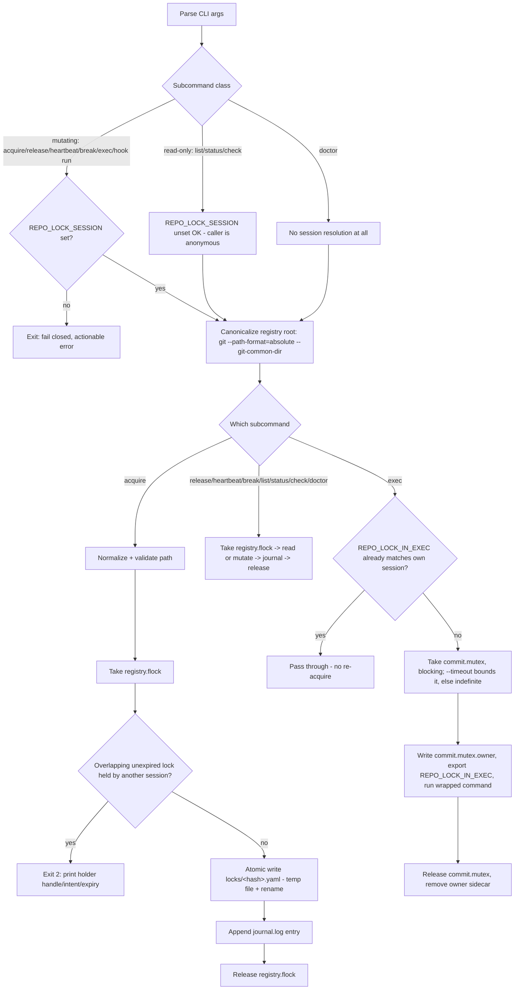

# Project Architecture

_status: implemented._

## Overview

Multiple concurrent AI sessions (and humans) work in the Noizu monorepo against one shared
checkout/branch. Two failure classes motivated this tool: edit collisions, where two workers
touch the same file with nothing enforcing the roadmap's social "lane ownership" convention
at runtime; and git index/HEAD races, where one session's `commit --amend` or `reset --soft`
sweeps up or unwinds another session's staged/committed work. File-level locks alone don't
stop the second class — it needs mutual exclusion around the whole stage+commit ritual, not
just around file contents.

`repo-lock` addresses both with two mechanisms sharing one registry: advisory file/directory
locks that other tooling and humans can check before editing, and a repo-wide mutex that
serializes git-state-mutating commands (`add`, `commit`, `amend`, `rebase`, `reset`, `merge`,
`cherry-pick`, `stash`) so two sessions never interleave mid-ritual. Both are advisory —
nothing in the filesystem stops an uncooperative process from ignoring a lock. Two points of
enforcement exist, both opt-in: a pre-commit hook that rejects commits touching locked paths or
racing the commit mutex, and a harness edit-time hook a user can wire in via `repo-lock check`.
See Integration Points below for what is and isn't actually covered.

Every registry-mutating operation requires a session identity (`REPO_LOCK_SESSION`) supplied
by the harness — see Identity & Session Resolution, the most load-bearing decision in this
design.

Locking style follows the monorepo's existing Rust utilities rather than inventing new
conventions: `flock(2)` via `libc` for the primitive (same RAII drop-guard pattern as
`direnv-config`'s store lock), and the same 4-glyph unicode session-handle scheme `doc-pointers`
already uses for display, so a session's identity reads the same way across tools — though here
the glyph is cosmetic only; see Key Decisions.

## Identity & Session Resolution

`REPO_LOCK_SESSION` (a UUID; intended to be the tobor session UUID) is the **required primary
identity** for every registry-mutating command — `acquire`, `release`, `heartbeat`, `break`,
`exec`, and `hook run` (the pre-commit hook's lock-reject decision). If unset, these commands
**fail closed**:

> `REPO_LOCK_SESSION is not set — refusing to run a registry-mutating command.` ... `Fix: have
> your harness export the session UUID before invoking repo-lock ... NEVER source
> REPO_LOCK_SESSION from a committed/shared .envrc: every session would then share one
> identity, every lock would look self-owned to every caller, and repo-lock would silently
> no-op.`

There is no silent auto-generated fallback: a fallback would mask exactly the harness-wiring
bug it should surface. Read-only commands (`list`, `status`, `check`) work with
`REPO_LOCK_SESSION` unset — the caller is treated as anonymous, so every existing lock reads as
foreign. A **set-but-malformed** value is still an error even for these read-only commands — it
signals a broken harness, not "no session." `doctor` skips session resolution entirely, not
even the anonymous pattern; it never needs to attribute a lock to "me."

**Must be exported per-session by the harness**, e.g. a session-start hook that exports the
tobor session UUID into the shell environment before any `repo-lock` invocation runs.
**Forbidden**: sourcing `REPO_LOCK_SESSION` from any committed/shared `.envrc`, for the reason
quoted above.

**Invariant**: every child/subagent shell must inherit the parent session's
`REPO_LOCK_SESSION`. Ordinary environment-variable inheritance within the harness's process
tree satisfies this — no extra propagation mechanism is needed as long as subagents run as
child processes (or equivalent) of the session that exported the variable.

## Dependencies

| Dependency | Purpose |
|------------|---------|
| `libc` | Raw `flock(2)` bindings for `registry.flock` and `commit.mutex` |
| `uuid` (v4 only) | Parse/validate `REPO_LOCK_SESSION`; internal ids (e.g. atomic-write temp filenames) |
| `serde` + `serde_yaml` | Lock record and `commit.mutex.owner` (de)serialization |
| `clap` (derive) | Subcommand/flag dispatch — 9 subcommands with a mixed value/boolean flag surface (wider than `misc-git-utils`' hand-rolled match; matches `direnv-config`'s `dc` precedent) |
| `sha2` | Path hashing for lock record filenames (`sha256-16` of repo-relative path) |
| `chrono` | RFC3339 timestamp formatting/parsing and TTL duration arithmetic (`acquired_at`/`refreshed_at`/`expires_at`, heartbeat's TTL-based extension) |
| `anyhow` | Error type/context style, matching `direnv-config`'s error handling rather than hand-rolled error enums |

## Execution Flow



## Subcommands

| Subcommand | Purpose |
|------------|---------|
| `acquire <path>... [--dir] [--ttl D=30m] [--intent MSG]` | Take a file or directory lock; same-session re-acquire refreshes. Requires `REPO_LOCK_SESSION` — fails closed if unset |
| `release <path>... \| --all` | Drop held lock(s). Requires `REPO_LOCK_SESSION` |
| `list [--mine\|--others\|--stale] [--ascii]` | Show registry contents; filters combine with AND. Works unset (anonymous view) |
| `status <path>...` | Show lock state for specific path(s). Works unset |
| `check <path>...` | Silent; exit 0 free / 2 locked-by-other — for scripts, the edit-time hook, and the pre-commit hook. Works unset (any lock reads as foreign) |
| `heartbeat [--all]` | Refresh `expires_at` by the lock's own stored `ttl` (not a fixed default) before it lapses; requires `REPO_LOCK_SESSION`. Fails with "re-acquire" if the record is missing or broken — never silently recreates it |
| `break <path> [--force]` | Clear a single lock. Expired locks, and same-host locks whose holder pid is no longer alive, break freely; any other unexpired lock needs `--force` and journals loudly |
| `exec [--label MSG] [--timeout D] -- <cmd>...` | Run `<cmd>` holding `commit.mutex` — guards the whole stage+commit ritual, not just `commit`. No `--timeout` blocks indefinitely. Exports `REPO_LOCK_IN_EXEC=<session-uuid>` to the child; a nested `exec` from the same session sees its own sentinel and passes through without re-acquiring |
| `hook install` | Install the managed pre-commit hook — wrap-and-chain, never overwrite (see Integration Points) |
| `hook run` | Internal — the installed hook `exec`s into this. Checks staged paths against the registry and non-blocking-probes `commit.mutex`; requires `REPO_LOCK_SESSION` like other mutating commands |
| `doctor` | Registry sanity check: orphaned/corrupt records, expired locks, dead-pid locks, journal tail. No session resolution at all |

Exit codes: `0` success; `2` (`EXIT_CONFLICT`) only for `acquire` overlap and `check`
locked-by-other; `1` for every other error, refusal, or `hook run` rejection.

## Lock Registry & Record

Registry root: `git rev-parse --path-format=absolute --git-common-dir` + `/repo-lock/` —
always canonicalized to an absolute path (a bare `--git-common-dir` can return a path relative
to the caller's cwd; repo-lock follows `doc-pointers`' `--absolute-git-dir` precedent rather
than risk a relative root silently pointing at the wrong directory). Shared by every worktree
of the repo, never appears in `git status`, needs no `.gitignore` entry.

```
repo-lock/
├── locks/<sha256-16 of repo-relative path>.yaml   # one record per held lock, written atomically (temp + rename)
├── registry.flock                                  # sentinel — every registry RMW under this flock
├── commit.mutex                                     # sentinel — mutex guarding the stage+commit ritual (exec)
├── commit.mutex.owner                                # advisory sidecar — holder identity while commit.mutex is held; self-healing, reaped when a probe finds the flock free
└── journal.log                                       # append-only: acquires, releases, expiries, breaks, exec-begin/end
```

Lock record schema (`locks/<hash>.yaml`):

```yaml
path: terraform/kubernetes/platform/ai      # repo-relative, normalized
kind: dir                                    # file | dir
holder:
  session: 9f2c1e4a-...                      # REPO_LOCK_SESSION UUID — the only authoritative identity
  handle: 𓆴𓎲𓋝𓁅                              # unicode4 display handle — cosmetic, lossy, not authoritative
  handle_hex: a1b2c3d4                        # 8-hex fallback for glyph-poor terminals
  host: dev-box
  pid: 48213                                  # the harness/shell's pid, not repo-lock's own — see Key Decisions
acquired_at: 2026-07-16T14:02:00Z
refreshed_at: 2026-07-16T14:02:00Z
expires_at: 2026-07-16T14:32:00Z              # acquired_at + ttl
ttl: "30m"                                    # original duration; heartbeat re-extends expires_at by this, not a fixed default
intent: "Wiring AI platform InfisicalSecret CRDs"
```

## Concurrency Model

Every operation that reads or mutates the registry — `acquire`, `release`, `heartbeat`,
`break`, `list`, `status`, `check`, `doctor`, and `hook run`'s staged-path scan — takes
`registry.flock` (`LOCK_EX`, blocking) for its full duration. This follows the `direnv-config`
`StoreLock` pattern: open-or-create a dedicated zero-byte sentinel file, hold the fd, let `Drop`
release the flock on scope exit. The sentinel is never written to or truncated after creation —
it exists purely as an flock target, not a data file.

**TOCTOU note**: holding the flock across the entire `acquire` operation — from the overlap
check through the yaml write and journal append — closes the check-then-act race. Two sessions
racing to acquire the same path serialize on the flock; the second to arrive sees the first
session's record already on disk and fails cleanly with exit 2, rather than both winning.

**Atomicity note**: lock record writes (`locks/<hash>.yaml`) are additionally atomic — written
to a temp file in the same directory, then renamed into place — so a reader never observes a
partially written record even outside the `registry.flock` critical section. Defense in depth
on top of the flock discipline above, not a replacement for it.

**Worktree / common-dir note**: because the registry lives under `--git-common-dir` rather than
`--git-dir`, every worktree of a repo shares one lock space, keyed by repo-relative path. A lock
taken from one worktree is visible and enforced from any other worktree of the same repo — this
is intentional (it's what makes the mutex a real merge-level safety net) but is a documented
limitation for divergent-branch workflows: locking a file on a feature-branch worktree also
locks it for a teammate working an unrelated branch in another worktree of the same repo. A
separately `git init`'d copy (e.g. a `Noizu/staging/` copy per this repo's git-trees convention)
has its own `.git` and therefore its own registry — it shares no locks with the origin checkout.
`commit.mutex` is a separate sentinel from `registry.flock` so a long-held `exec` never blocks
unrelated file/dir lock operations, and vice versa.

**Filesystem note**: the registry assumes a local filesystem. `flock(2)` semantics over NFS and
similar network filesystems are unreliable or unsupported by many implementations; NFS-hosted
checkouts are out of scope for v1.

## Integration Points

**Hook installation — wrap-and-chain, not overwrite.** `repo-lock hook install` never
overwrites an existing `.git/hooks/pre-commit`. It resolves the per-worktree hooks directory
via `git rev-parse --absolute-git-dir` — a different call from the registry's shared
`--git-common-dir` root, since hooks live per-worktree while locks don't. If a `pre-commit`
exists and isn't already marked with the `# repo-lock-managed-hook` marker, it's renamed to
`pre-commit.chained` (kept executable) and the managed hook invokes it first — a chained-hook
failure short-circuits the commit before repo-lock's own checks run. A first-time install with
no existing hook just writes the managed hook directly; re-running `install` is idempotent — it
detects its own marker, regenerates the hook body (keeping the binary path current), and leaves
any chain untouched. If both an unmanaged hook and a leftover `pre-commit.chained` exist,
install refuses rather than guessing which to keep. **Known interaction**: `doc-pointers hook`
installs by a different, overwrite-based convention (see Key Decisions) — running it *after*
`repo-lock hook install` clobbers the chain; re-run `repo-lock hook install` afterward to
restore it.

**Commit-time enforcement.** The managed hook (`hook run`) makes two checks on every commit:
(1) reads staged paths and rejects the commit if any is locked by another session; (2) does a
non-blocking probe (`LOCK_EX|LOCK_NB`) of `commit.mutex` and, if held by another session,
rejects citing the holder identity read from the advisory `commit.mutex.owner` sidecar —
extending mutex protection to bare `git commit` callers who bypass `exec`. The probe is
opportunistic: if it finds the mutex actually free, it also reaps any stale
`commit.mutex.owner` file left behind by a crashed holder. If the hook is running inside its
own session's `exec` (`REPO_LOCK_IN_EXEC` matches), it skips the mutex probe entirely, so a
session's own `exec -- git commit` never rejects itself. `hook run` requires
`REPO_LOCK_SESSION` like any other mutating command — an unset session fails the hook closed
too.

**Edit-time enforcement (opt-in).** v1 ships the `check` subcommand and a documented example
harness `PreToolUse` hook config in the README (matcher on `Edit|Write|MultiEdit`, running
`repo-lock check <path>` and blocking the tool call on a non-zero exit). Wiring it in is a
user/harness opt-in step — `hook install` only installs the commit-time hook, never the
edit-time one.

**Honesty note.** Without the edit-time hook actually configured, nothing stops two sessions
from concurrently editing the same locked file before either commits — repo-lock only
guarantees the commit-time and mutex-probe checks fire. And even with the pre-commit hook
installed, a bare commit that bypasses hooks entirely (`git commit --no-verify`, or hooks
disabled in the environment) isn't covered by anything short of a person or process choosing to
check first.

## Key Decisions

- **Central registry vs. per-file sidecars**: a single registry under the git common dir avoids
  scattering lock files across the tree and lets `dir` locks be expressed as a prefix match over
  one registry — a sidecar-per-file scheme has no natural home for a directory-scoped lock.
- **git-common-dir vs. tracked `.locks/`**: lock state is ephemeral session state, not repo
  content. Living under `--git-common-dir` means it's automatically shared across worktrees,
  never committed, needs no `.gitignore` entry, and doesn't survive into a fresh clone (nobody
  should inherit a stale lock from someone else's checkout).
- **Absolute registry path**: `git rev-parse --git-common-dir` alone can return a path relative
  to the caller's cwd. repo-lock always resolves it via `--path-format=absolute
  --git-common-dir`, following `doc-pointers`' `--absolute-git-dir` precedent — a relative root
  would silently point at the wrong directory the moment a subcommand runs from a cwd other
  than the repo root. `hook install` separately resolves the per-worktree hooks directory via
  `--absolute-git-dir` — a different call for a different, worktree-local path.
- **`REPO_LOCK_SESSION` required, fail closed, no auto-fallback**: mutating commands refuse to
  run rather than silently generating a session id, because a fallback would mask exactly the
  harness-wiring bug (missing session export) it should surface; a shared committed `.envrc`
  value is explicitly forbidden for the same reason — it would make every lock look self-owned
  to every caller. A set-but-malformed value still errors even for read-only commands, since
  that signals broken wiring rather than "no session." See Identity & Session Resolution above.
- **Advisory vs. enforced**: flock + yaml can't stop a direct edit or `rm`. Enforcement is
  opt-in and layered — a commit-time hook that's installed by default once `hook install` runs,
  and an edit-time hook that requires explicit harness wiring — rather than filesystem-permission
  enforcement that would fight normal tooling. See Integration Points for what remains uncovered.
- **Wrap-and-chain vs. `doc-pointers`' overwrite-or-refuse**: `doc-pointers`' installer refuses
  to touch an unmanaged pre-commit hook and requires a human to resolve the conflict by hand.
  `repo-lock` instead preserves and chains any existing hook, because refusing to install would
  leave the repo without lock protection in the common case where something else already
  occupies `pre-commit`. Trade-off: the two installers' conventions don't compose automatically
  (see Integration Points' known interaction note).
- **`exec` reentrancy via env sentinel**: `REPO_LOCK_IN_EXEC` lets a nested `exec` — or the
  pre-commit hook firing inside one — recognize its own session's already-held mutex and pass
  through instead of deadlocking on a self-held flock or spuriously rejecting its own commit.
- **Rust vs. shell**: correct `flock` semantics, structured yaml I/O, and stable path hashing
  are all easy to get subtly wrong in bash and prone to TOCTOU races; matches the existing
  `direnv-config` and `misc-git-utils` precedent instead.
- **TTL 30m + break vs. manual-only**: sessions crash or get killed without releasing locks. A
  lock is no guarantee past `expires_at` — holders must heartbeat at an interval shorter than
  the TTL to keep a lock alive. Expired locks, and same-host locks whose holder pid is confirmed
  dead, break without `--force`; any other unexpired lock still requires `--force` and journals
  loudly, preserving the advisory-but-visible contract for the rare deliberate override. 30m
  keeps a crashed session's exposure window short given heartbeat is cheap. `holder.pid` records
  the harness/shell's (parent) pid, not repo-lock's own — the CLI process is ephemeral and
  always exits before anyone reads the record, so its own pid would always read dead and make
  every same-host lock break freely, defeating the dead-pid check entirely.
- **`uuid` v4 only**: v5 deterministic derivation is dropped as unused now that session identity
  comes from the harness via `REPO_LOCK_SESSION`, not generated by `repo-lock` itself.
- **unicode4 handle reuse, cosmetic only**: reusing `doc-pointers`' 4-glyph base-1072 encoding
  (U+13000–U+1342F) instead of inventing a new display scheme keeps session handles visually
  consistent across Noizu tooling. It is explicitly **cosmetic and lossy** (~40 bits of a 128-bit
  UUID — display collisions are possible); the full session UUID in the lock record is the only
  authoritative identity, the glyph and its 8-hex fallback are for human/log readability only.
  The encoder is duplicated verbatim from `doc-pointers` rather than depended on, so `repo-lock`
  has no Cargo/build dependency on `misc-git-utils`; the 8-hex fallback itself is new for
  `repo-lock` — no precedent in `doc-pointers`.
- **clap vs. manual dispatch**: `repo-lock` has 9+ subcommands (including internal `hook run`)
  and a mixed value/boolean flag surface — closer to `direnv-config`'s `dc` than to
  `misc-git-utils`' small, hand-rolled match statement, so `clap` derive was chosen over manual
  dispatch.
- **Non-goals (v1)**: no section/line-range locks (file/dir only — a file needing finer locking
  should be split); no per-session `GIT_INDEX_FILE` isolation (too disruptive to git UX for v1,
  noted as a v2 experiment); no network/cross-host coordination (single-host registry only —
  cross-host is the tobor MCP `Lock.*` v2 path); no support for network filesystems (`flock`
  over NFS is unreliable/unsupported — local filesystem only); no enforcement beyond the two
  opt-in hooks above.
