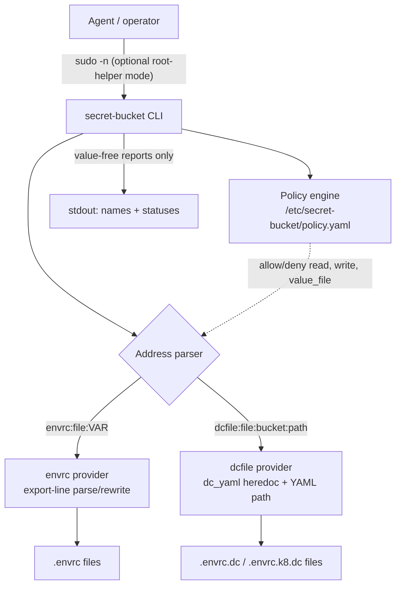

# Project Architecture — secret-bucket

## Overview

`secret-bucket` is a single-binary Rust CLI for agent-safe manipulation of
local secret-bearing configuration files (`.envrc`, `.envrc.dc`,
`.envrc.k8.dc`). It models each secret location as an opaque "bucket item"
addressed by a typed URI-like string, and supports `list`, `diff`, `copy`, and
`set` operations whose output is **value-free by contract**: only key names,
addresses, and status words ever reach stdout/stderr. This lets AI agents and
CI pipelines repair or synchronize secrets without leaking values into
transcripts, shell traces, or logs.

The design goal is operational hygiene, not adversarial sandboxing — a process
with filesystem access can still read the files. For stronger local controls,
an optional privilege-separated mode installs the binary as a root helper
behind a narrow `NOPASSWD` sudoers rule with a root-owned YAML policy file
allowlisting exactly which paths may be read, written, or used as value
sources. See `PRD.md` for the full requirements and logging contract.

## System Diagram

## Core Components

All components live in `src/main.rs` (single-file crate, ~850 lines including
inline tests).

| Component | Purpose |
|-----------|---------|
| CLI layer (`Cli`, `Command`) | clap-derived commands: `list`, `diff`, `copy`, `set`; global `--policy` flag; `--dry-run`, `--format text\|json` |
| `Address` | Parses/validates `envrc:<file>[:<VAR>]` and `dcfile:<file>:<bucket>[:<yaml.path>]`; `safe_label()` renders addresses without values |
| envrc provider | Parses `export KEY=value` lines (double/single-quoted, escapes, comments); rewrites in place preserving indentation and unrelated lines |
| dcfile provider | Locates `dc_yaml <bucket> <<MARKER` heredoc blocks, parses embedded YAML, flattens to dotted paths, splices updated YAML back preserving surrounding shell |
| `Policy` engine | Loads root-owned YAML allowlist (`allow.read/write/value_file`); rejects non-absolute or group/world-writable policy files; canonicalizes all paths before matching (dir prefixes allowed) |
| Reporting (`emit_*`) | Value-free output: key lists, diff groups (`same`/`changed`/`missing_left`/`missing_right`), JSON action reports |

## Data Flow

Every command parses its address(es), authorizes each file against the policy
(if `--policy` was given), then dispatches to the matching provider. `diff`
reads both sides fully into memory, compares values there, and prints only key
names bucketed by status. `copy` reads the source value and writes it to the
destination without it ever touching output; `set` reads the value from a
policy-allowlisted `--value-file` instead. Inline regression tests use
sentinel secret strings and assert they never appear in serialized output.

## Key Decisions

- **Rust single binary, no shell**: eliminates shell-substitution leak paths
  (`set -x`, command logs) inherent to `sed`/`grep` workflows; also enables
  the root-helper install where a small auditable executable is the only
  thing granted sudo.
- **Value-free logging contract as the primary guarantee**: no values, no
  prefixes, no hashes — enforced by sentinel-based tests, not just convention.
- **Policy allowlist over sandboxing**: canonicalized absolute-path allowlists
  (defeating symlink escapes) provide privilege separation without needing
  containers; policy cannot be overridden via environment variables.
- **Text-splicing file updates**: `.envrc` and `dc_yaml` edits rewrite only
  the targeted line/block, preserving surrounding shell content; full YAML
  formatting fidelity inside `dc_yaml` blocks is an accepted non-goal.
- **`set` takes `--value-file`, never `--value`**: keeps new secret values
  out of argv (visible in `ps`, shell history, agent transcripts).

## Fit in the Noizu Utilities Ecosystem

Lives under `utilities/shell/` but is deliberately **standalone Rust** — it
does not source `share/k8-lib` (the shared shell library used by the sibling
bash utilities) and reads no `.infra-config.yaml`. Its `Makefile` follows the
repo convention: `make install` places the release binary in `~/.local/bin`,
so the monorepo's `make install-utilities` flow picks it up alongside the
shell tools (build is skipped gracefully when `cargo` is absent). It is the
low-level, file-local complement to the `dc` direnv-config tool and the
Infisical pipeline: root `CLAUDE.md` prescribes it for agent-safe file ops
(`secret-bucket diff envrc:.envrc dcfile:.envrc.dc:secrets`) in the secrets
flow that ultimately feeds `infisical-populate-secrets` and the k8s operator.

## Technology Stack

Rust 2021 crate; dependencies: `clap` (derive CLI), `serde`/`serde_yaml`/
`serde_json` (policy + dcfile parsing, JSON output), `anyhow` (errors),
`tempfile` (dev). Release profile is size-optimized. `Cargo.lock` committed.

## Related Documents

- [PRD.md](PRD.md) — requirements, logging contract, acceptance criteria
- [PROJ-LAYOUT.md](PROJ-LAYOUT.md) — file/directory map
- [policy.example.yaml](policy.example.yaml), [sudoers.example](sudoers.example) — root-helper install templates
