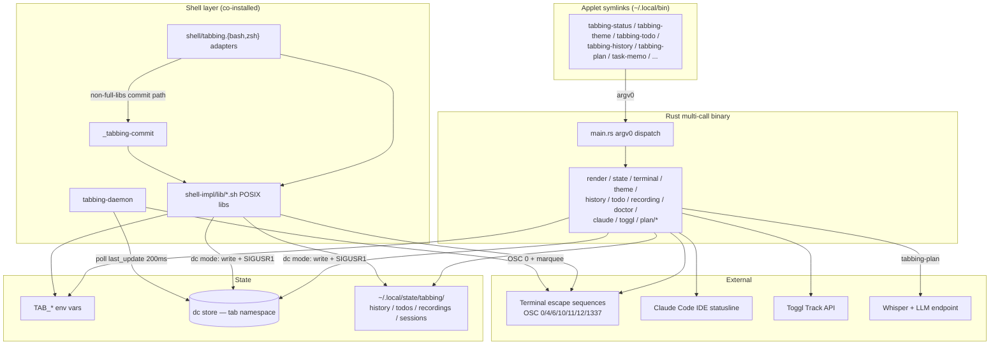

# Project Architecture

## Overview

tabbing-on is a terminal tab title/status/task manager: it sets tab titles, colors,
status text, emoji, and urgency; manages per-tab todos; logs tab history; records
sessions via asciinema; applies terminal color themes; and bridges state to the
Claude Code IDE statusline and Toggl Track. It supports iTerm2, Ghostty, Kitty,
WezTerm, Alacritty, Apple Terminal, and others.

The project carries **two parallel implementations** plus a prototype:

1. **Rust** (`rust/`, v0.2.0) — the primary implementation. A single multi-call
   binary (`tabbing-on`) that dispatches on argv0; installed applet symlinks
   (`tabbing-status`, `tabbing-theme`, `tabbing-plan`, `task-memo`, ...) select
   the subcommand, BusyBox-style.
2. **Pure shell** (`shell-impl/`) — the original implementation. POSIX libraries
   under Bash/Zsh adapters. Still authoritative for the pieces that must run *in*
   the interactive shell (adapters, `_tabbing-commit`, `tabbing-daemon`) and
   co-installed alongside the Rust binary.
3. **Ink TUI prototype** (`ink-plan/`) — an Ink/React (Node ≥ 20) exploration of
   the `tabbing-plan` voice-memo-to-ticket flow, since reimplemented in Rust
   (`rust/src/plan/`).

Shell/Rust feature coverage is tracked in [FEATURE-PARITY.md](FEATURE-PARITY.md);
file-level breakdowns live in [PROJ-LAYOUT.md](PROJ-LAYOUT.md) and
[layout/](layout/).

Two runtime modes apply to both implementations: **env mode** (default) keeps
state in `TAB_*` shell environment variables; **dc mode** (`TABBING_ON_DC_MODE=1`,
requires the sibling `direnv-config` utility) stores state in a shared key-value
store with a background daemon that owns tab title rendering.

## System Diagram



## Core Components

| Component | Location | Purpose |
|-----------|----------|---------|
| Dispatch | `rust/src/main.rs` | argv0 multi-call routing to subcommand modules |
| Render | `rust/src/render.rs`, `shell-impl/lib/render.sh` | Title/status/emoji/color render pipeline |
| State | `rust/src/state.rs`, `shell-impl/lib/dc.sh` | `TAB_*` model + direnv-config write-through, timestamps, daemon notify |
| Terminal | `rust/src/terminal.rs`, `shell-impl/lib/terminal.sh` | Emulator detection, escape sequence abstraction |
| Theme | `rust/src/theme*.rs`, `shell-impl/lib/theme*.sh` | Theme load/apply/clone/edit; ratatui picker (Rust); `TAB_THEME_DATA` blob ([theme-data-format.md](theme-data-format.md)) |
| History | `rust/src/history.rs`, `shell-impl/lib/history.sh` | TAB_ID generation, YAML event log, search, reports |
| Todo | `rust/src/todo.rs`, `shell-impl/lib/todo.sh` | Per-tab todo CRUD (shell adds provider pattern) |
| Recording | `rust/src/recording.rs`, `shell-impl/lib/recording.sh` | asciinema recording lifecycle |
| Doctor | `rust/src/doctor.rs`, `shell-impl/bin/tabbing-doctor` | Detect/patch Kitty & Ghostty configs that override titles |
| Claude bridge | `rust/src/claude.rs`, `bridge.rs`, `shell-impl/lib/claude.sh` | Claude Code IDE statusline via FIFO + state file |
| Toggl | `rust/src/toggl.rs`, `shell-impl/lib/toggl.sh` | Toggl Track time-entry lifecycle |
| Plan | `rust/src/plan/`, `ink-plan/` | `tabbing-plan`/`task-memo`: mic capture → Whisper transcription → LLM classification → PM ticket files |
| Shell adapters | `shell-impl/shell/tabbing.{bash,zsh}` | In-shell user functions so `TAB_*` exports persist; precmd/PROMPT_COMMAND hooks |
| Daemon | `shell-impl/bin/tabbing-daemon` | dc-mode background renderer + status marquee (shell-only; Rust symlink exists) |
| Bootstrap | `rust/src/init.rs`, `shell-impl/bin/tabbing-init` | Emits shell-appropriate `source`/setup code for `eval` |

## Dual Implementation & Parity

The Rust binary is the install default (`make install`); the shell tree remains
installable standalone (`make install-shell`). The two share the same state
files, dc keys, and escape sequences, so they interoperate on one machine.
Division of labor:

- **Rust owns** the CLI surface and everything interactive-heavy: the ratatui
  theme picker (search, inline color editor, code preview), the `tabbing-plan`
  TUI, HTTP integrations (reqwest).
- **Shell owns** what must execute inside the user's interactive shell: the
  Bash/Zsh adapter functions (env exports can't cross a subprocess boundary),
  `_tabbing-commit` (installed as a real script, not a symlink), the dc-mode
  daemon, and `demo-runner`.

→ *See [FEATURE-PARITY.md](FEATURE-PARITY.md) for the full matrix.*

## State Management

### Env Mode (default)

Runtime state lives in exported `TAB_*` variables scoped to the shell session:
`TAB_TITLE`, `TAB_STATUS`, `TAB_HIGHLIGHT`, `TAB_URGENCY`, `TAB_EMOJI`,
`TAB_THEME`, plus auto-set `TAB_ID` (8-char hex per tab), `TAB_SESSION`
(session fingerprint), and `TAB_TERMINAL` (detected emulator).

### DC Mode (`TABBING_ON_DC_MODE=1`)

State is written through to a direnv-config store under the `tab` namespace
(`title`, `status`, `highlight`, `urgency`, `emoji`, `theme`, `last_update`).
All mutations go through a single path (`_tabbing_set` / `state.rs`) that
exports the env var, writes the dc key, bumps `last_update` (ms epoch), and
signals the daemon with SIGUSR1. The daemon polls `last_update` at 200ms as a
fallback and marquee-scrolls status text exceeding the 20-char clip.

### Persistent State

XDG-compliant files under `$XDG_STATE_HOME/tabbing/` (default `~/.local/state/tabbing/`):

```
history/{TAB_ID}.yaml              # Timestamped event log
todos/{TAB_ID}.yaml                # Per-tab todo items
recordings/{TAB_ID}/*.cast         # asciinema recordings
sessions/{TAB_SESSION}.env         # Persisted env for CLI subprocesses
claude-{TAB_SESSION}.pipe/.state   # Claude bridge FIFO + flat state file
claude-bridge-{TAB_SESSION}.pid    # Bridge reader PID
```

User themes live in `~/.config/tabbing-on/themes/`; `tmp-xdg/` in the repo is a
scratch XDG tree for local testing.

## Terminal Abstraction

Terminal detection (env-var probing, priority iTerm2 > Ghostty > Kitty >
WezTerm > Apple Terminal > Windows Terminal > Alacritty > Konsole > GNOME
Terminal > tmux > xterm) feeds capability-gated output: OSC 0 titles
(universal), iTerm2 OSC 6 tab color and OSC 1337 badges, Kitty remote control,
and OSC 4/10/11/12 full-palette theme recoloring. `tabbing-doctor` patches
Kitty/Ghostty configs that would otherwise clobber titles.

## Installation & Ecosystem Fit

tabbing-on lives at `utilities/shell/tabbing-on/` in the Noizu Infra monorepo
and is a SUBDIR of `utilities/shell/Makefile`, so the repo-root
`make install-utilities` recurses into its own `Makefile`. Unlike the sibling
DevOps utilities it does **not** source `share/k8-lib/` and has no
`.infra-config.yaml` build/deploy footprint — it is a purely local terminal
tool, but it targets the same `~/.local/bin` install convention.

`make install` (default target): `cargo build --release`, install the binary
as `~/.local/bin/tabbing-on`, create ~19 applet symlinks pointing at it,
install `_tabbing-commit` as a real script, copy `shell-impl/lib/*.sh` and the
adapters to `~/.local/share/tabbing-on/`, and drop a `use_tabbing` direnv
helper into `~/.config/direnv/lib/`. `make install-shell` installs the legacy
pure-shell tree instead. Activation: `eval "$(tabbing-init bash|zsh)"` in the
shell rc.

Integration touchpoints with the wider ecosystem: **direnv-config** (sibling
utility) backs dc mode; **Claude Code** consumes the statusline bridge; the
repo `.envrc` sets `TAB_THEME` and `NPL_PROJECT` for tobor session tooling.

## Key Design Decisions

- **Multi-call binary with argv0 dispatch**: one Rust binary, many applet
  symlinks — single build artifact, per-command UX
- **Keep the shell layer**: env exports and prompt hooks must run in-process in
  the user's shell; a compiled binary cannot mutate the parent environment, so
  adapters + `_tabbing-commit` + daemon stay shell and are co-installed
- **Single mutation path** (`_tabbing_set` / `state.rs`): env export + dc
  write-through + `last_update` bump + SIGUSR1, so both implementations and the
  daemon stay consistent
- **`last_update` as change sentinel**: daemon checks one ms-epoch key instead
  of diffing fields; SIGUSR1 gives instant refresh, 200ms poll drives marquee
- **POSIX library layer**: shell libs are pure POSIX (`_tabbing_*` prefix);
  bash/zsh-isms confined to adapters
- **Only `render.sh` (+ `dc.sh`) sourced at shell init**: keeps prompt hooks
  fast; heavy libs load on demand in `bin/` subprocesses
- **YAML persistence parsed via `sed`/`awk`**: human-readable, zero external
  deps in the shell path; `dc` and `asciinema` optional
- **Per-tab / per-session isolation**: unique `TAB_ID` per tab for
  history/todos/recordings; `TAB_SESSION` scopes env persistence and the
  Claude bridge
- **Claude bridge via FIFO**: named pipe decouples the render pipeline from the
  IDE statusline consumer
- **Prototype-then-port**: `tabbing-plan` was explored in Ink/React
  (`ink-plan/`, needs SoX + LiteLLM/Whisper) before landing in Rust; the
  prototype is retained for reference
