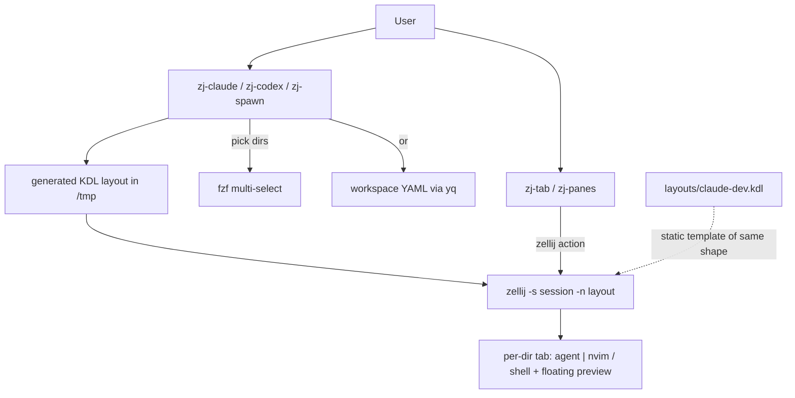

# Project Architecture

## Overview

`utilities/shell/zellij` is a small terminal-workspace utility package: five
standalone bash launchers plus one shared KDL layout that open zellij
sessions, tabs, or panes pre-wired for agentic development. Each project
directory gets the standard "dev tab" shape — an AI coding agent (Claude Code
or Codex) prefilled in the left pane, `nvim` on the right, a thin shell pane
on the bottom, and an optional floating preview pane running a dev-server
command (`--start-app`).

The architectural core is **runtime KDL layout generation**: the batch
launchers (`zj-claude`, `zj-codex`, `zj-spawn`) collect target directories
(interactive `fzf` multi-select or a declarative workspace YAML read via
`yq`), render a temporary layout file under `/tmp` with one tab per
directory, then exec `zellij -s <session> -n <layout>`. The incremental tools
(`zj-tab`, `zj-panes`) instead extend a live session via `zellij action`.
Agent commands are *prefilled, not auto-run*: a shell-specific prompt trick
(`vared` on zsh, `read -e -i` on bash) puts the command on the user's input
line so they press Enter to launch — a human-confirmation gate before an
agent starts.

## System Diagram

## Core Components

| Component | Purpose |
|-----------|---------|
| `bin/zj-claude` | Session with one dev tab per selected directory, Claude Code prefilled; fzf picker, workspace YAML, `--cerebras`/`--zai` provider shorthands |
| `bin/zj-codex` | Same generator as zj-claude but queues `codex` (mirrored flag set: `--codex-args`, `--codex-command`) |
| `bin/zj-spawn` | Generic sibling: tab (or 4x4 pane grid) per selected subdir running an arbitrary command |
| `bin/zj-tab` | Add one claude dev tab to the current session, or start a session if outside one |
| `bin/zj-panes` | Split the *current* tab in a live session into the standard claude/nvim/shell panes (requires `ZELLIJ_SESSION_NAME`) |
| `layouts/claude-dev.kdl` | Static KDL layout of the same dev-tab shape, installed to `~/.config/zellij/layouts` for direct `zellij -n claude-dev` use |
| `Makefile` | `make install` → `bin/*` to `~/.local/bin`, `layouts/*.kdl` to `~/.config/zellij/layouts`; `compile`/`test` are no-ops |

## Configuration Layering

CLI flags override workspace-YAML keys, which override defaults. The
workspace file (`--workspace file.yaml`) declares `directories`, plus
optional `session`, `claude_args`, `claude_command`, `claude_message`,
`start_app`, and `command` — making a multi-repo agent workspace
reproducible from one file. `--claude-command` overrides the whole
invocation (e.g. `run-claude with cerebras-pro`, exposed as the
`--cerebras`/`--zai` shorthands); `--claude-message`/`--prompt` appends a
starting prompt.

## Key Decisions

- **Prefill, don't auto-run agents**: shell-native editable prompts (zsh
  `vared`, bash `read -e -i`) queue the agent command; the user confirms
  with Enter. Unknown shells degrade to printing the command.
- **Generated layouts over static ones**: tab count and per-tab cwd are only
  known at invocation time, so KDL is emitted to a temp file (cleaned by an
  EXIT trap) rather than parameterizing a stock layout. `claude-dev.kdl` is
  kept as the static single-tab equivalent.
- **Session-name truncation to 20 chars**: zellij session names become Unix
  socket path segments; macOS caps socket paths at 104 bytes. Collisions on
  an existing session get a timestamp suffix unless `--session` was explicit.
- **KDL + shell escaping is explicit**: `kdl_escape` for layout strings and
  `printf '%q'` for embedded shell commands keep arbitrary paths/commands
  injection-safe across the two quoting layers.
- **No `share/k8-lib` dependency**: unlike most Noizu utilities, these are
  self-contained (only `zellij`, `fzf`, optional `yq`/`nvim`), so they work
  on machines without the infra lib installed.

## Ecosystem Fit

Part of the Noizu Infra monorepo's `utilities/` family: installed alongside
the DevOps tools by repo-root `make install-utilities`, which delegates to
this package's `Makefile`. It reads no `.infra-config.yaml` and touches no
cluster — it is purely local developer ergonomics for running fleets of
coding agents (one tab per project subtree, e.g. across `projects/`) inside
zellij. The `run-claude with <provider>` shorthands integrate with the
sibling provider-wrapper tooling on `PATH`.

## Documentation

- `docs/PROJ-LAYOUT.md` — file/directory layout of this package
- `docs/PROJ-ARCH.summary.md` — synced summary of this document
