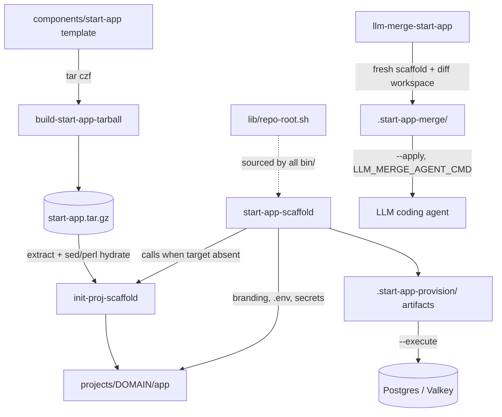

# Project Architecture — start-app-scaffold

## Overview

`start-app-scaffold` is a terminal utility package (pure Bash) that turns the
`components/start-app` Elixir + Next.js template in the Noizu Infra monorepo
into new, fully hydrated portfolio projects. It packages the template as a
tarball, extracts it into `projects/<domain>/app`, rewrites placeholder
identity (module names, OTP app, DB names, branding, domains), and emits
provisioning artifacts (Postgres SQL, Valkey ACL, Helm values) that can be
applied immediately with `--execute` or handed off to the normal deploy
pipeline.

The package is layered: `build-start-app-tarball` (template packaging) →
`init-proj-scaffold` (extract + base hydration) → `start-app-scaffold`
(identity/branding hydration + provisioning) → `llm-merge-start-app`
(re-scaffold an *existing* app and delegate the merge to an LLM coding
agent). Tools run both in-repo and installed standalone to `~/.local/bin`,
with a shared repo-root resolver in `lib/repo-root.sh` bridging the two modes.

## System Diagram

## Core Components

| Component | Purpose |
|-----------|---------|
| `bin/build-start-app-tarball` | Rebuild `start-app.tar.gz` from the live template when sources are newer (`-f` forces) |
| `bin/init-proj-scaffold` | Extract tarball to target, hydrate Elixir/Docker/frontend names, rename files/dirs, verify no `Starter` remnants, stamp `.base-hydration.yaml` |
| `bin/start-app-scaffold` | End-to-end scaffold + provision: branding/domain rewrites, `.env` secrets, `.start-app-provision/` artifacts, optional `--execute` apply |
| `bin/llm-merge-start-app` | Stage a fresh scaffold beside an existing app, build diff/metadata/prompt workspace, optionally invoke an LLM agent to merge |
| `lib/repo-root.sh` | Repo-root resolver: `$INFRA_ROOT` → script-dir walk-up → `$PWD` walk-up; errors instead of falling back to `/` |
| `Makefile` | `test` (bash -n syntax checks), `install` (bin → `~/.local/bin`, lib → `~/.local/share/start-app-scaffold`) |

## Hydration Pipeline

`init-proj-scaffold` derives all names from three inputs (`project_dir`,
`slug`, PascalCase `elixir_module`): OTP app, web module, dev/test DB names,
frontend package name. Hydration is content substitution (sed over `*.ex/
*.exs`, Dockerfile, package.json) followed by bottom-up file/directory
renames, then a remnant grep for leftover `Starter`/`:starter` references.
`start-app-scaffold` layers a second pass: app name/tagline/site domain into
frontend sources, Cypress config, branding YAML, and `.env` keys
(DATABASE_URL, REDIS_URL, cookie/app domains), generating passwords via
`openssl rand` when not supplied.

## Provenance Tracking

Both scaffolding tools record what they did into the target's
`.base-hydration.yaml`: `init-proj-scaffold` fills `__PLACEHOLDER__` tokens
(tarball md5, inputs, derived names, timestamps); `start-app-scaffold`
replaces the `applied: false` stanza with its full argument/derived-value
block. This gives every scaffolded app a machine-readable record of its
template version and hydration inputs — which `llm-merge-start-app` later
uses to infer project identity when re-scaffolding.

## Provisioning Artifacts

`start-app-scaffold` writes `<target>/.start-app-provision/`:
`provision-postgres.sql` (idempotent role + database creation, SQL-escaped),
`provision-valkey.acl` (ACL SETUSER line), `helm-values.generated.yaml`
(domains, image refs against `ops.noizu.com` registry, SSO domains), and
`summary.txt`. Default mode is artifacts-only; `--execute` with
`--postgres-url`/`--valkey-url` applies them via `psql`/`redis-cli`. Note the
monorepo caveat that runtime Valkey `ACL SETUSER` is ephemeral across pod
recreation — durable ACLs belong in the upstream Helm chart.

## LLM Merge Workflow

`llm-merge-start-app` re-scaffolds a *fresh* hydrated copy for an existing
app, then builds a merge workspace (`<target>/.start-app-merge/` by default)
containing `metadata.env`, `diff.patch`/`diff-stat.txt` (secrets excluded),
file-set inventories, recent git history, and a generated `agent-prompt.md`.
With `--apply` it invokes an agent — `--agent-cmd`/`$LLM_MERGE_AGENT_CMD`
first, falling back to `codex exec` then `claude -p` — passing the prompt
path via `LLM_MERGE_PROMPT_FILE`. This lets template improvements flow into
already-customized apps without hand-merging.

## Ecosystem Fit

- **Install model**: unlike most `utilities/*` siblings, this package does
  *not* source `share/k8-lib` and is not installed by the top-level
  `make install-utilities`; it has its own `Makefile` (`make install`) and
  ships its own shared lib to `~/.local/share/start-app-scaffold`.
- **Dual-mode execution**: every `bin/` script sources `lib/repo-root.sh`
  relatively when in-repo, else from `$STARTAPP_LIB_DIR` /
  `~/.local/share/start-app-scaffold`; installed copies locate the monorepo
  via `$INFRA_ROOT` or `$PWD` walk-up.
- **Downstream conventions**: generated apps land in `projects/` (subtree
  layout), reference the `ops.noizu.com` registry, and produce Helm values
  aligned with the `.infra-config.yaml` / `deploy-service` pipeline; the
  Helm wrapper chart itself lives in the upstream `noizu-infra` repo
  (`init-proj-scaffold --helm/--no-helm` controls that prompt).

## Key Decisions

- **Tarball as transfer format**: snapshots the template with build junk
  excluded (`node_modules`, `_build`, lockfiles, `.env`) and yields an md5
  recorded in `.base-hydration.yaml` for provenance.
- **Never resolve repo root to `/`**: `repo-root.sh` exists because the old
  per-script walk-up silently bottomed out at `/` for installed copies.
- **Artifacts before side effects**: provisioning is written to disk first;
  mutating shared Postgres/Valkey requires the explicit `--execute` flag.
- **LLM-assisted template upgrades**: structural merges of diverged apps are
  delegated to a coding agent with a curated diff workspace rather than
  attempted with 3-way merge heuristics.
- **`sed -i ''` (BSD form) in `init-proj-scaffold`**: hydration seds use the
  macOS/BSD in-place flag, which GNU sed on Linux treats as an empty backup
  suffix argument — a known portability sharp edge (the newer
  `start-app-scaffold` pass uses `perl -0pi` instead).

## Related Docs

- [PROJ-LAYOUT.md](PROJ-LAYOUT.md) — file tree and per-file notes
