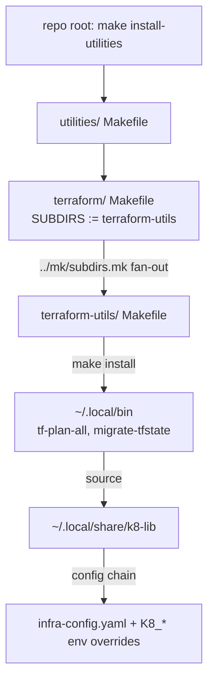

# Project Architecture — utilities/terraform

## Overview

`utilities/terraform/` is a **grouping directory** within the Noizu Infra
utilities tree: it holds no executable code of its own, only a delegating
Makefile and one (currently) child utility package, `terraform-utils/`. Its
architectural role is aggregation — it lets the repo-root
`make install-utilities` pipeline reach every Terraform-related DevOps tool
through a single, uniform fan-out point.

Each child is a self-contained, self-documented utility package following the
shared utilities conventions: scripts in `bin/` installed to `~/.local/bin`,
an install-only `Makefile` (with `compile`/`test` as no-ops), and dependence
on the shared **k8-lib** shell library (`~/.local/share/k8-lib`) for config
resolution against `.infra-config.yaml` / `infra-config.yaml`. Child
internals are documented in the child's own `docs/` — this document only
describes the grouping layer and how children plug into the wider ecosystem.

## System Diagram

## Core Components

| Component | Purpose | Docs |
|-----------|---------|------|
| `Makefile` | Declares `SUBDIRS := terraform-utils`, includes `../mk/subdirs.mk` to fan standard targets (install, compile, test) out to children | — |
| `terraform-utils/` | `tf-plan-all` (batch plan across ad-hoc root modules with status table) and `migrate-tfstate` (local tfstate → S3 backend from infra-config) | [Architecture](../terraform-utils/docs/PROJ-ARCH.summary.md) · [Layout](../terraform-utils/docs/PROJ-LAYOUT.summary.md) |

## Ecosystem Fit

- **Install path**: children install via `make install` into `~/.local/bin`,
  triggered transitively by the repo-root `make install-utilities` target.
- **Shared library**: children source k8-lib for logging, config layering
  (config file first, `K8_TF_*`/`K8_AWS_*` env overrides second), and the
  `--assist` AI-help hook.
- **Scope boundary**: these tools target *ad-hoc* Terraform module trees;
  the Terragrunt-orchestrated stacks under `terraform/kubernetes/` at repo
  root have their own workflow and are not managed here.

## Key Decisions

- **Grouping layer, not a package**: keeps `utilities/` flat-ish while
  allowing multiple Terraform tools to share one fan-out point; new tools are
  added as sibling folders appended to `SUBDIRS`.
- **Standard subdirs.mk contract**: every child must answer the standard
  targets (no-op where inapplicable) so the top-level pipeline never
  special-cases Terraform utilities.
- **Docs delegation**: child packages own their architecture docs; this file
  links to child summaries instead of duplicating internals.
